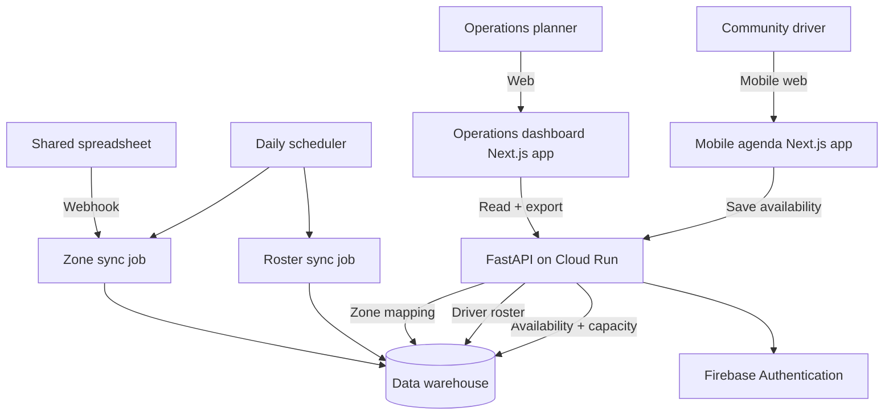

# Community Fleet Capacity

> Public case study — sanitized for portfolio use.  
> Production system source: private corporate repository.

---

## Problem

A delivery company runs a community-driver program in several cities. Local drivers cover the last mile in their own neighborhoods.

Before this platform, operations staff called each driver every day to ask:

- Can you work tomorrow?
- How many packages can you take?
- Which zone will you cover?

The answers were captured in informal messages and shared spreadsheets. The company could not see in real time how many drivers were available for each zone on each day. They also could not tell whether a missing answer meant "not available" or simply "did not reply yet."

---

## Solution

A three-piece platform:

1. **Mobile agenda** — drivers open a simple web app, pick a week, and toggle their availability day by day. They also set their capacity for each day they are available.
2. **Operations dashboard** — planners see a filterable table of all drivers, their declared availability, their capacity, and their zone. They can export a daily CSV or a consolidated range for planning.
3. **Sync backend** — scheduled jobs keep the driver roster, zone mapping, and availability records in sync between the data warehouse, the shared operational spreadsheet, and the web apps.

The platform turns a phone-call process into a self-service form that gives planners a live capacity picture.

---

## Architecture

---

## Technology stack

- **Backend API:** Python 3.11, FastAPI, Pydantic
- **Data warehouse:** managed analytics database
- **Frontend 1 (operations dashboard):** Next.js 16, React 19, TypeScript, Tailwind CSS
- **Frontend 2 (mobile agenda):** Next.js 16, React 19, TypeScript, Tailwind CSS
- **Authentication:** Firebase Authentication with Google sign-in
- **Sync / jobs:** Cloud Run Jobs, Cloud Scheduler, Google Sheets API, Apps Script webhooks
- **Secrets:** cloud provider secret manager

---

## Key results

- Driver roster sync reaches nearly all active community drivers through automated sync.
- Zone mapping stays current via a webhook from the shared operations spreadsheet.
- Each sync scan stays small and low-cost by using a targeted MERGE query.
- Scheduled sync runs several times per operating day to reflect changes quickly.
- Planners stopped relying on phone calls and started using the live dashboard for daily capacity decisions.

---

## What makes the design interesting

1. **Two frontends, one backend.** A driver-facing mobile agenda and an operations dashboard share the same FastAPI backend and data warehouse. Each surface shows only the fields that user needs.
2. **Week picker for drivers.** Drivers choose the current week and the next week in a mobile-first calendar. Toggling a day updates availability and capacity in one action.
3. **Effective-date rule for capacity.** Each capacity record has a start date, so historical plans do not change retroactively when a driver updates future availability.
4. **Spreadsheet-driven zone mapping.** Operations still edits zone assignments in a shared spreadsheet. An Apps Script webhook pushes changes to the backend, so the web apps stay in sync without manual imports.
5. **Append-only audit.** Every sync and every availability change is logged in an event table, so data issues can be traced back to the exact job or user action.
6. **Multi-select filters.** The operations dashboard lets planners filter by date, depot, zone, team, status, name, and email, then export the current view to CSV.

---

## What is not in this repository

- The real Python source code or database schemas
- Data warehouse names, table names, or column definitions
- Cloud project IDs, service account keys, or API keys
- Real driver names, phone numbers, addresses, or zone names
- Real depot identifiers or capacity numbers
- Production deployment configuration
- The shared spreadsheet identifier or webhook secret

---

## Assets

- [`assets/architecture.mmd`](assets/architecture.mmd) — Mermaid source for the architecture diagram above
- [`assets/ops-dashboard-mockup.html`](assets/ops-dashboard-mockup.html) — static HTML mockup of the operations dashboard
- [`assets/ops-dashboard-mockup.png`](assets/ops-dashboard-mockup.png) — exported PNG of the operations dashboard
- [`assets/mobile-agenda-mockup.html`](assets/mobile-agenda-mockup.html) — static HTML mockup of the driver mobile agenda
- [`assets/mobile-agenda-mockup.png`](assets/mobile-agenda-mockup.png) — exported PNG of the driver mobile agenda

---

## Disclaimer

The actual production system is maintained in a private corporate repository. This public repository contains only a sanitized case study: problem description, generic architecture, technology stack, business impact, and illustrative mockups. No proprietary code or confidential information is included.
